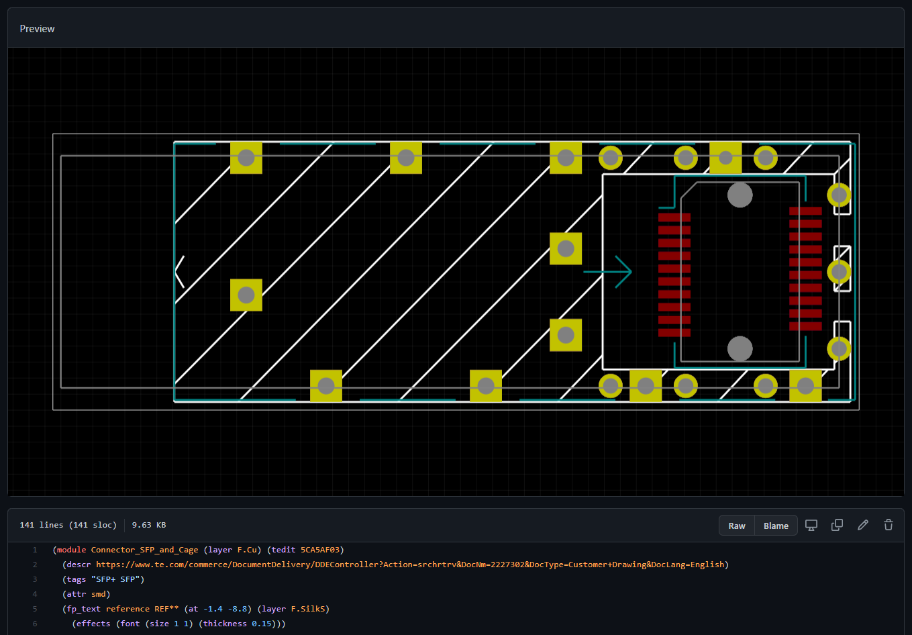

# GitHub KiCad Footprint Preview Userscript

This is a userscript for Tampermonkey that shows graphical previews of KiCad footprints on GitHub.

This works for any `.kicad_mod` file you view on GitHub.

The script has been tested with Tampermonkey for Chrome. It should also work on Greasemonkey, and Chromium, but I have not tested it.

## Features

This script currently supports displaying:

- Lines and arcs with the correct width
- Circular, ellipse, oval, rectangle, and rounded-rectangle TH / SMD pads
- Non-plated TH pads
- Separate colours for copper, silkscreen, paste, mask, fabrication, and courtyard
- Separate colours for front, inner, and back layers
- Background grid (one line = 1 unit in the file)

This should be sufficient to quickly identify whether a part is the one you wanted.

### Bugs / missing stuff

Stuff with limited or no support:

- Text
- Pad rotation values outside of 90 degree steps
- Custom pad shapes (currently not shown at all)
- Models - this will probably never be supported

## Contributing

Issues and pull requests welcome, but keep in mind that this was just hacked together in an evening because it was an interesting challenge, so I probably won't invest too much more time in it.

## Changelog

**v0.4.2**

Switched colour scheme to match KiCad Classic.

**v0.4.1**

Added a very slight amount of transparency to all drawing, to make it possible to see the shadow of bottom-layer elements under top-layer elements.

Fixed layer ordering bug. Now each layer is drawn in sequence globally, instead of per-part. This also fixes a problem where drill holes weren't drawn on top in some cases.

Re-ordered layers to better match what you'd see in KiCad.

**v0.4.0**

Major overhaul. Parsing now done in a lexer-like fashion, translated to a syntax tree. This is then built out into a model of the part using classes.

Added support for arcs.

Added support for layers.

Added support for oval (slot) shaped pads.

Added limited support for pad rotation (90 degree steps only).

**v0.3.3**

Patched in limited support for 3-value `at` specifications for circle and oval pads. Previously any pad with this type of `at` spec was just missing from the preview render, because the regex didn't match on them. Given that I've only seen multiples of 90 as the third value, it appears to be rotation. For circles this is obviously meaningless. Currently the rotation is ignored.

**v0.3.2**

Patched in basic support for `oval`. They are drawn as ellipses rather than slots, but that's better than just not showing up at all.

**v0.3.1**

Fixed missing support for `np_through_hole` pads.

Note: They currently render just like regular pads, but in all examples seen so far the pad size and drill size are the same, so the rendered copper area is obscured by the drill hole anyway.

**v0.3:**

Added limited `roundrect` support - displaying as plain rectangles.

**v0.2:**

Added support for circular SMD pads.

**v0.1**

Initial release.