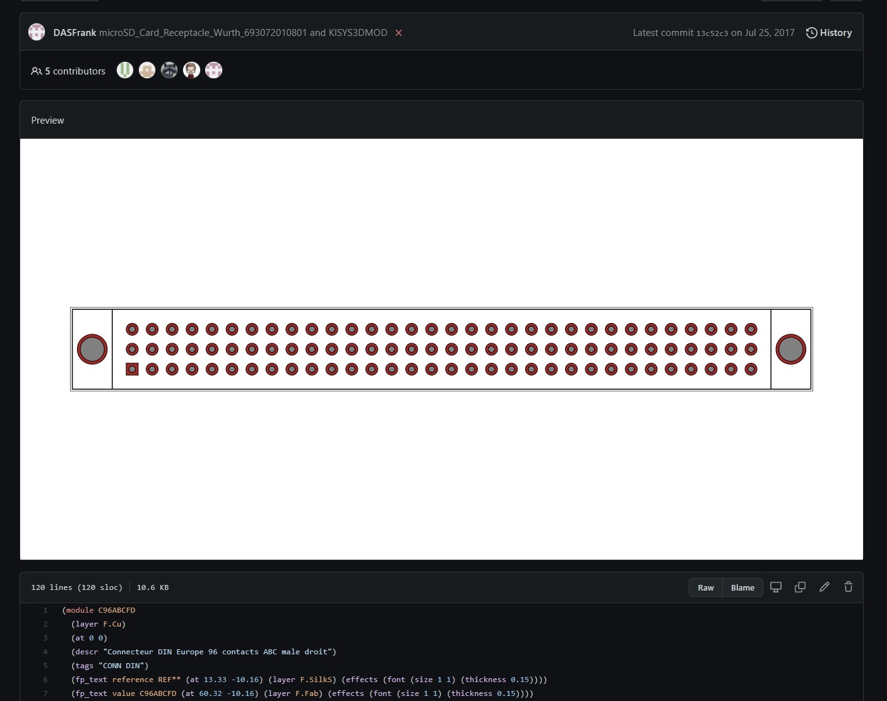

# GitHub KiCad Footprint Preview Userscript

This is a userscript for Tampermonkey that shows graphical previews of KiCad footprints on GitHub.

This works for any `.kicad_mod` file you view on GitHub.

This is a low-effort script that does most of its parsing with regex. It currently supports displaying:

- Lines (`fp_line`) with the correct width.
- Circular thru-hole pads.
- Circular SMD pads.
- Rectangular pads with optional thru-holes.
- Rounded rectangle pads (displayed as rectangles)

This should be sufficient to quickly identify whether a part is the one you wanted.

The script has been tested with Tampermonkey for Chrome. It should also work on Greasemonkey, and Chromium, but I have not tested it.

Issues and pull requests welcome, but keep in mind that this was just hacked together in an evening because it was an interesting challenge, so I probably won't invest too much more time in it.

